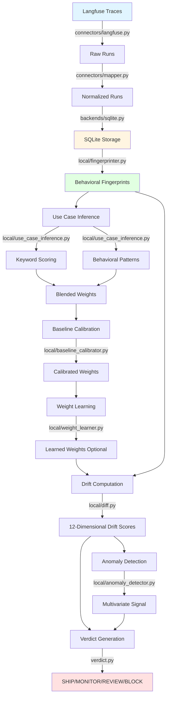

# Driftbase Architecture

This document provides a comprehensive overview of Driftbase's drift detection pipeline, from trace ingestion through verdict generation.

## Core Concept

**Driftbase is institutional memory for AI agent behavior.**

It analyzes behavioral drift across 12 dimensions to detect when an agent's decision-making, performance, or reliability characteristics change between versions. The system operates in two modes:

1. **Production mode**: Imports real traces from Langfuse and detects drift
2. **Demo mode**: Generates synthetic data for exploration without external dependencies

## High-Level Pipeline



## Detailed Component Breakdown

### 1. Trace Ingestion (`connectors/langfuse.py`)

**Purpose**: Import traces from Langfuse and normalize to Driftbase schema.

**Key Classes**:
- `LangFuseConnector`: Main connector class
  - `fetch_traces()`: Retrieves traces from Langfuse API
  - `map_trace()`: Converts Langfuse trace to Driftbase run schema
  - `validate_credentials()`: Checks API key validity
  - `list_projects()`: Enumerates available Langfuse projects

**Data Flow**:
```
Langfuse API → fetch_traces() → map_trace() → backend.write_run() → SQLite
```

**Output Schema** (per run):
```python
{
    "id": str,
    "session_id": str,           # agent identifier
    "deployment_version": str,    # version label or epoch-{date}
    "environment": str,
    "started_at": datetime,
    "completed_at": datetime,
    "latency_ms": int,
    "tool_sequence": str,         # JSON array of tool names
    "tool_call_count": int,
    "output_length": int,
    "error_count": int,
    "semantic_cluster": str,      # error/escalated/resolved/unknown
    "verbosity_ratio": float,     # completion_tokens / prompt_tokens
    "loop_count": int,
    "time_to_first_tool_ms": int,
    "retry_count": int,
}
```

### 2. Run Mapping (`connectors/mapper.py`)

**Purpose**: Transform external trace formats to Driftbase's behavioral schema.

**Key Functions**:
- `infer_semantic_cluster(output, error)`: Maps agent outcomes to clusters
  - `"error"`: Exception or failure occurred
  - `"escalated"`: Keywords indicate human handoff
  - `"resolved"`: Normal completion
  - `"unknown"`: Cannot infer

- `compute_verbosity_ratio(prompt_tokens, completion_tokens)`:
  - Returns `completion_tokens / prompt_tokens`
  - Measures output verbosity relative to input

- `extract_tool_sequence(observations)`:
  - Extracts tool names from Langfuse observations
  - Returns `(tool_sequence_json, tool_call_count)`

**Heuristics**:
- Escalation keywords: `["escalat", "transfer", "human agent", "supervisor", "unable to", ...]`
- Used when explicit outcome labels unavailable

### 3. Fingerprinting (`local/fingerprinter.py`)

**Purpose**: Aggregate individual runs into statistical behavioral fingerprints.

**Key Function**: `build_fingerprint_from_runs(runs, window_start, window_end, deployment_version, environment)`

**Computed Metrics**:
```python
BehavioralFingerprint:
    # Tool usage patterns
    tool_sequence_distribution: dict[str, float]  # JSON: {sequence: probability}
    avg_tool_call_count: float
    top_tool_sequences: dict[str, float]          # Top 10 by frequency

    # Latency profile
    p50_latency_ms: int
    p95_latency_ms: int
    p99_latency_ms: int

    # Output characteristics
    avg_output_length: float
    avg_verbosity_ratio: float

    # Reliability
    error_rate: float                             # errors / total_runs
    retry_rate: float                             # retries / total_runs
    avg_retry_count: float

    # Decision patterns
    semantic_cluster_distribution: dict[str, float]  # {cluster: probability}

    # Reasoning depth
    avg_loop_count: float
    p95_loop_count: float
    avg_time_to_first_tool_ms: float

    # Metadata
    sample_count: int
    window_start: datetime
    window_end: datetime
```

**Example**:
```python
# 100 runs → 1 fingerprint
runs = [AgentRun(...), AgentRun(...), ...]
fp = build_fingerprint_from_runs(
    runs=runs,
    window_start=datetime(2026, 4, 1),
    window_end=datetime(2026, 4, 2),
    deployment_version="v2.0",
    environment="production"
)
# fp.p95_latency_ms = 1200
# fp.error_rate = 0.03
# fp.tool_sequence_distribution = {"['search', 'summarize']": 0.45, ...}
```

### 4. Use Case Inference (`local/use_case_inference.py`)

**Purpose**: Infer agent type to apply domain-specific drift weight profiles.

**Two-Stage Inference**:

#### 4a. Keyword Scoring
`infer_use_case(tool_names)` → `{use_case, confidence, matched_keywords}`

- **Method**: Keyword matching against 14 use case profiles
- **Scoring**: High-signal keywords (×2), medium-signal keywords (×1)
- **Tool name decomposition**: `"process_order"` → `["process order", "process", "order"]`
- **Pattern scoring**: Generic tool names get pattern-based scoring (e.g., `"search_*"` → RESEARCH_RAG)

**Example**:
```python
tool_names = ["fraud_check", "validate_kyc", "approve_loan"]
result = infer_use_case(tool_names)
# result = {
#     "use_case": "FINANCIAL",
#     "confidence": 0.87,
#     "matched_keywords": ["fraud", "kyc", "approve", "loan"]
# }
```

#### 4b. Behavioral Pattern Matching
`infer_use_case_from_behavior(runs)` → `{use_case, confidence, behavioral_signals}`

- **Method**: Rule-based classification from behavioral metrics
- **Signals extracted**:
  - `escalation_rate`, `resolution_rate`, `error_rate`
  - `avg_loop_depth`, `avg_tool_count`, `avg_output_length`
  - `avg_verbosity_ratio`, `avg_latency_p95`, `avg_time_to_first_tool`

**Example**:
```python
# High escalation rate + low tool count → CUSTOMER_SUPPORT
signals = {
    "escalation_rate": 0.18,
    "avg_tool_count": 3.2,
    "avg_latency_p95": 2500,
}
result = infer_use_case_from_behavior(runs)
# result = {"use_case": "CUSTOMER_SUPPORT", "confidence": 0.72}
```

#### 4c. Blending
`blend_inferences(keyword_result, behavioral_result)` → `{use_case, blended_weights, blend_method}`

- **Method**: Confidence-weighted blending
- **Conflict resolution**: Use higher confidence classifier
- **Output**: Final use case + dimension weights that sum to 1.0

**14 Use Cases**:
```python
USE_CASES = [
    "FINANCIAL",           # Fraud detection, loan approval, KYC
    "CUSTOMER_SUPPORT",    # Ticket routing, escalation, sentiment
    "RESEARCH_RAG",        # Search, retrieval, summarization
    "CODE_GENERATION",     # Code writing, test running, debugging
    "AUTOMATION",          # Workflow orchestration, RPA
    "CONTENT_GENERATION",  # Writing, SEO, social media
    "HEALTHCARE",          # Diagnosis, medication, triage
    "LEGAL",               # Contract review, compliance, redlining
    "HR_RECRUITING",       # Resume parsing, candidate scoring
    "DATA_ANALYSIS",       # SQL queries, dashboards, forecasting
    "ECOMMERCE_SALES",     # Product recommendations, inventory
    "SECURITY_ITOPS",      # Vulnerability scanning, incident response
    "DEVOPS_SRE",          # Deployment, monitoring, runbooks
    "GENERAL",             # Fallback for unknown agents
]
```

**Weight Profiles**: Each use case has preset dimension weights. Example:

```python
USE_CASE_WEIGHTS["FINANCIAL"] = {
    "decision_drift": 0.30,              # Critical: approval/rejection logic
    "error_rate": 0.18,                  # Critical: failures unacceptable
    "tool_sequence": 0.15,               # Important: audit trail
    "latency": 0.10,
    "semantic_drift": 0.08,
    "tool_sequence_transitions": 0.05,
    "tool_distribution": 0.05,
    "loop_depth": 0.04,
    "time_to_first_tool": 0.02,
    "verbosity_ratio": 0.01,
    "retry_rate": 0.01,
    "output_length": 0.01,
}

USE_CASE_WEIGHTS["RESEARCH_RAG"] = {
    "output_length": 0.22,               # Critical: response completeness
    "verbosity_ratio": 0.16,             # Important: detail level
    "tool_sequence": 0.16,               # Important: retrieval strategy
    "tool_distribution": 0.13,
    "semantic_drift": 0.12,
    "decision_drift": 0.09,
    "latency": 0.05,
    # ... (less critical dimensions get lower weights)
}
```

### 5. Baseline Calibration (`local/baseline_calibrator.py`)

**Purpose**: Adjust dimension weights based on baseline variance and compute statistical thresholds.

**Key Function**: `calibrate(baseline_version, eval_version, inferred_use_case, sensitivity, ...)`

**Process**:

1. **Variance-Based Reliability**:
   ```python
   # Consistent dimensions get higher weight
   cv = std / mean  # coefficient of variation
   reliability_multiplier = 1.0 / (1.0 + cv)
   ```

2. **Correlation Adjustment** (ADR-016):
   ```python
   # Detect correlated pairs (ρ > 0.7)
   # Example: latency ↔ retry_rate (timeouts cause retries)
   # Reduce weight of less important dimension by up to 50%
   for (dim_a, dim_b, correlation) in correlated_pairs:
       if correlation > 0.70:
           less_important = dim_a if weight_a < weight_b else dim_b
           adjustment = min(0.50, correlation * 0.5)
           weight[less_important] *= (1.0 - adjustment)
   ```

3. **Weight Redistribution**:
   ```python
   # If semantic_drift data unavailable, redistribute its weight
   unavailable = ["semantic_drift"]
   weights = _redistribute_weights(weights, unavailable)
   ```

4. **Power Analysis**:
   ```python
   # Compute minimum runs needed per dimension
   # Using two-sample test formula:
   # n = 2 * ((z_alpha/2 + z_beta) * sigma / delta) ** 2
   min_runs_needed = compute_min_runs_needed(
       baseline_dimension_scores,
       use_case="FINANCIAL",  # effect_size = 0.05 (strict)
       alpha=0.05,            # false positive rate
       power=0.80             # 80% chance to detect real drift
   )
   # Returns: {"overall": 85, "per_dimension": {...}, "limiting_dimension": "error_rate"}
   ```

5. **Learned Weights Blending**:
   ```python
   # If agent has labeled deploy outcomes (good/bad), blend learned weights
   # At 10 samples: 20% learned, 80% preset
   # At 100+ samples: 90% learned, 10% preset
   if learned_weights_available:
       final_weight[dim] = (
           learned_factor * learned_weight[dim] +
           (1 - learned_factor) * calibrated_weight[dim]
       )
   ```

**Output**: `CalibrationResult`
```python
{
    "calibrated_weights": dict[str, float],           # sum to 1.0
    "composite_thresholds": {                         # calibrated thresholds
        "MONITOR": 0.18,  # increased from 0.15 (high variance)
        "REVIEW": 0.32,
        "BLOCK": 0.48
    },
    "reliability_multipliers": dict[str, float],
    "correlated_pairs": [(dim_a, dim_b, correlation), ...],
    "correlation_adjusted": bool,
    "learned_weights_available": bool,
    "learned_weights_n": int,
    "top_predictors": list[str],                      # top 3 dimensions by correlation
}
```

### 6. Weight Learning (`local/weight_learner.py`)

**Purpose**: Learn which dimensions predict bad outcomes for a specific agent.

**Key Function**: `learn_weights(agent_id, db_path)` → `LearnedWeights | None`

**Requirements**:
- 10+ labeled deploy versions with `outcome ∈ {good, bad}`
- Labels provided via `driftbase deploy outcome <version> good|bad`

**Method**: Point-Biserial Correlation
```python
# For each dimension:
# X = dimension drift scores [0.1, 0.3, 0.05, ...]
# Y = binary outcome [0, 1, 0, ...]  (0=good, 1=bad)
# Compute correlation ρ
correlation = pointbiserialr(Y, X)

# Normalize correlations to weights (sum to 1.0)
learned_weights[dim] = correlation[dim] / sum(correlations)

# Blend with preset weights based on sample size
blended[dim] = (
    learned_factor * learned_weights[dim] +
    (1 - learned_factor) * preset_weights[dim]
)
```

**Example**:
```python
# Agent has 15 labeled deploys
# 8 good, 7 bad
# error_drift strongly correlates with bad outcomes (ρ=0.82)
# latency_drift weakly correlates (ρ=0.15)
result = learn_weights(agent_id="support-bot")
# result.weights = {
#     "error_rate": 0.35,      # boosted from 0.18
#     "latency": 0.08,         # reduced from 0.12
#     ...
# }
# result.learned_factor = 0.40  # 40% learned, 60% preset (n=15)
# result.top_predictors = ["error_rate", "decision_drift", "retry_rate"]
```

### 7. Drift Computation (`local/diff.py`)

**Purpose**: Compute 12-dimensional drift scores and weighted composite score.

**Key Function**: `compute_drift(baseline, current, baseline_runs, current_runs, sensitivity, backend)`

**Confidence Tiers** (ADR-005, ADR-014):

```python
TIER1 (n < 15):
    # Insufficient data - show progress bars only
    # No drift scores, no verdict

TIER2 (15 ≤ n < min_runs_needed):
    # Indicative signals only
    # Directional arrows (↑ ↓ →) for each dimension
    # No numeric scores, no verdict

TIER3 (n ≥ min_runs_needed):
    # Full statistical analysis
    # 12-dimensional drift scores
    # Composite drift score
    # Bootstrap 95% confidence interval
    # Verdict generation
```

**12 Drift Dimensions** (ADR-004, ADR-015):

1. **decision_drift**: JSD of tool sequence distributions
   - Measures: Decision logic changes, tool selection patterns
   - Method: Jensen-Shannon Divergence (JSD) on tool sequences

2. **tool_sequence**: JSD of ordered tool call sequences
   - Measures: Tool ordering, workflow changes
   - Method: JSD on tool call order

3. **tool_distribution**: Distribution shift in tool usage frequency
   - Measures: Tool preference changes
   - Method: Currently proxied by decision_drift

4. **latency**: Percentile latency drift (p95)
   - Measures: Performance degradation/improvement
   - Method: Relative change in p95 latency, sigmoid-normalized

5. **error_rate**: Change in error frequency
   - Measures: Reliability drift
   - Method: Absolute difference × 2.0, sigmoid-normalized

6. **loop_depth**: Change in reasoning depth (agentic loops)
   - Measures: Planning complexity changes
   - Method: Relative change in p95 loop count, sigmoid-normalized

7. **verbosity_ratio**: Change in output-to-input token ratio
   - Measures: Response detail level drift
   - Method: Absolute difference in completion/prompt ratio, sigmoid-normalized

8. **retry_rate**: Change in retry frequency
   - Measures: Resilience pattern changes
   - Method: Absolute difference × 2.0, sigmoid-normalized

9. **output_length**: Change in response length
   - Measures: Content volume drift
   - Method: Relative change in avg output length, sigmoid-normalized

10. **time_to_first_tool**: Planning latency before first tool call
    - Measures: "Thinking time" changes
    - Method: Relative change in avg time to first tool, sigmoid-normalized

11. **semantic_drift**: JSD of outcome cluster distributions
    - Measures: Outcome pattern changes (error/escalated/resolved)
    - Method: JSD on semantic clusters

12. **tool_sequence_transitions**: Transition matrix drift
    - Measures: Tool chaining pattern changes
    - Method: Currently proxied by decision_drift (TODO: implement transition matrix)

**Composite Score Calculation**:
```python
drift_score = (
    w_decision * decision_drift +
    w_tool_seq * tool_sequence_drift +
    w_tool_dist * tool_distribution_drift +
    w_latency * sigmoid(latency_delta) +
    w_error * sigmoid(error_delta) +
    w_loop * sigmoid(loop_delta) +
    w_verbosity * sigmoid(verbosity_delta) +
    w_retry * sigmoid(retry_delta) +
    w_output_len * sigmoid(output_len_delta) +
    w_planning * sigmoid(planning_delta) +
    w_semantic * sigmoid(semantic_drift) +
    w_transitions * tool_transitions_drift
)

# Floor: If decision_drift > 0.30, ensure drift_score ≥ 0.15
if decision_drift > 0.30:
    drift_score = max(drift_score, 0.15)
```

**Bootstrap Confidence Interval** (ADR-009):
```python
# 500 iterations, resample with replacement
for i in range(500):
    baseline_sample = resample(baseline_runs)
    current_sample = resample(current_runs)
    fp_baseline = build_fingerprint(baseline_sample)
    fp_current = build_fingerprint(current_sample)
    scores.append(_compute_drift_score(fp_baseline, fp_current))

drift_score_lower = percentile(scores, 2.5)   # 95% CI lower bound
drift_score_upper = percentile(scores, 97.5)  # 95% CI upper bound
```

**Example Output**:
```python
DriftReport:
    drift_score: 0.24
    drift_score_lower: 0.18
    drift_score_upper: 0.29
    severity: "moderate"
    confidence_tier: "TIER3"

    # Dimension breakdown
    decision_drift: 0.15
    latency_drift: 0.32
    error_drift: 0.08
    semantic_drift: 0.05
    loop_depth_drift: 0.12
    # ... (7 more dimensions)

    # Context (before → after)
    baseline_p95_latency_ms: 850
    current_p95_latency_ms: 1250
    baseline_error_rate: 0.02
    current_error_rate: 0.05

    # Calibration metadata
    inferred_use_case: "CUSTOMER_SUPPORT"
    calibration_method: "learned"  # or "statistical" or "preset_only"
    learned_weights_available: True
    learned_weights_n: 15
    top_predictors: ["latency", "error_rate", "decision_drift"]
```

### 8. Anomaly Detection (`local/anomaly_detector.py`)

**Purpose**: Supplementary multivariate signal to catch correlated shifts missed by per-dimension scoring.

**Key Function**: `compute_anomaly_signal(baseline_runs, eval_runs)` → `AnomalySignal | None`

**Method**: Isolation Forest (ADR-011)
```python
# 1. Extract 12-dimensional behavioral vectors from each run
baseline_vectors = [extract_behavioral_vector(run) for run in baseline_runs]
eval_vectors = [extract_behavioral_vector(run) for run in eval_runs]

# 2. Standardize features using baseline distribution
scaler = StandardScaler()
baseline_scaled = scaler.fit_transform(baseline_vectors)
eval_scaled = scaler.transform(eval_vectors)

# 3. Fit isolation forest on baseline (contamination=0.05)
model = IsolationForest(contamination=0.05, n_estimators=100)
model.fit(baseline_scaled)

# 4. Score eval runs (negative = outlier)
raw_scores = model.decision_function(eval_scaled)

# 5. Normalize to [0, 1] where 1 = most anomalous
normalized = (max_score - raw_scores) / (max_score - min_score)

# 6. Aggregate: use 90th percentile of eval anomaly scores
anomaly_score = percentile(normalized, 90)
```

**Levels**:
```python
CRITICAL:  score ≥ 0.75  # Override verdict up to REVIEW
HIGH:      score ≥ 0.55
ELEVATED:  score ≥ 0.30
NORMAL:    score < 0.30
```

**Verdict Override Logic**:
```python
if anomaly_signal.level == "CRITICAL":
    if severity in ["none", "low"]:
        severity = "moderate"  # SHIP → MONITOR
        anomaly_override = True
    elif severity == "moderate":
        severity = "significant"  # MONITOR → REVIEW
        anomaly_override = True
```

**Example**:
```python
# Agent has moderate drift_score=0.22
# But isolation forest detects CRITICAL multivariate anomaly
# (latency + error_rate + loop_depth shifted together)
anomaly = compute_anomaly_signal(baseline_runs, eval_runs)
# anomaly.score = 0.82
# anomaly.level = "CRITICAL"
# anomaly.contributing_dimensions = ["latency", "error_rate", "loop_depth"]

# Verdict overridden: MONITOR → REVIEW
```

### 9. Verdict Generation (`verdict.py`)

**Purpose**: Map drift scores to actionable ship/no-ship decisions.

**Key Function**: `compute_verdict(report, baseline_tools, current_tools, baseline_n, current_n, baseline_label, current_label)`

**Verdict Types** (ADR-010):
```python
Verdict.SHIP:     # drift_score ≤ MONITOR threshold
    - No meaningful behavioral change
    - Safe to deploy
    - Exit code: 0

Verdict.MONITOR:  # MONITOR < drift_score ≤ REVIEW
    - Minor drift detected
    - Ship with awareness
    - Track initial rollout metrics
    - Exit code: 0

Verdict.REVIEW:   # REVIEW < drift_score ≤ BLOCK
    - Behavioral change detected
    - Review before shipping
    - Investigate root cause
    - Exit code: 1

Verdict.BLOCK:    # drift_score > BLOCK
    - Major divergence
    - Do not ship without investigation
    - Critical dimension changed significantly
    - Exit code: 1
```

**Threshold Selection**:
```python
# Use calibrated thresholds from baseline (if available)
thresholds = report.composite_thresholds or {
    "MONITOR": 0.15,
    "REVIEW": 0.28,
    "BLOCK": 0.42,
}

# Special case: decision_drift alone can trigger REVIEW/BLOCK
if report.decision_drift > 0.40:
    return Verdict.BLOCK
elif report.decision_drift > 0.25:
    return Verdict.REVIEW
```

**Next Steps Generation**:
```python
# Based on highest drift dimension and specific metrics
if highest_dim == "decision_drift":
    steps = [
        "Review system prompt changes between versions",
        "Check outcome routing and decision tree logic"
    ]
    if escalation_rate_delta > 0.1:
        steps.append(f"Investigate escalation logic - rate jumped {multiplier:.1f}× from baseline")

elif highest_dim == "latency_drift":
    steps = [
        "Profile tool call sequences for unnecessary chaining",
        "Check if reasoning depth or model endpoint changed"
    ]

elif highest_dim == "error_drift":
    steps = [
        "Check tool availability and API endpoint health",
        "Review error logs for new failure modes"
    ]

# Generic for high drift
if drift_score > 0.20:
    steps.append(f"Run 'driftbase diagnose {baseline} {current}' for root cause analysis")
```

**Example Output**:
```python
VerdictResult:
    verdict: Verdict.REVIEW
    title: "REVIEW BEFORE SHIPPING"
    explanation: "Behavioral change detected (drift score 0.32). Latency increased 47% (p95 ~1250ms). Review changes before promoting to production."
    next_steps: [
        "Profile tool call sequences for unnecessary chaining",
        "Check if reasoning depth or model endpoint changed",
        "Run 'driftbase diagnose v1.0 v2.0' for detailed root cause analysis"
    ]
    exit_code: 1
    style: "yellow"
    symbol: "⚠"
```

## Storage Layer (`backends/`)

**Backend Abstraction** (`backends/base.py`):
```python
class StorageBackend(Protocol):
    def write_run(self, run: dict) -> None
    def write_runs(self, runs: list[dict]) -> None
    def get_runs(self, deployment_version, environment, limit) -> list[dict]
    def get_calibration_cache(self, cache_key) -> dict | None
    def set_calibration_cache(self, cache_key, data) -> None
    def get_learned_weights(self, agent_id) -> dict | None
    def write_learned_weights(self, agent_id, data) -> None
    def get_significance_threshold(self, agent_id, version) -> dict | None
    def write_significance_threshold(self, agent_id, version, data) -> None
```

**SQLite Implementation** (`backends/sqlite.py`):
- Single-file database: `~/.driftbase/runs.db` (default)
- Tables:
  - `runs`: Individual agent executions
  - `calibration_cache`: Cached calibration results
  - `learned_weights`: Per-agent learned weights
  - `significance_thresholds`: Cached power analysis results
  - `budget_config`: Per-agent drift budgets
  - `budget_breaches`: Budget violation records
  - `connector_syncs`: Langfuse import metadata
  - `labeled_deploys`: Deploy outcome labels (good/bad)
- Background writer with batching (10 runs per transaction)
- Retention pruning (configurable via `DRIFTBASE_MAX_RUNS`)

**Factory Pattern** (`backends/factory.py`):
```python
def get_backend() -> StorageBackend:
    backend_type = os.getenv("DRIFTBASE_BACKEND", "sqlite")
    if backend_type == "sqlite":
        return SQLiteBackend(db_path)
    # Future: return PostgresBackend(), CloudBackend(), etc.
```

## CLI Interface (`cli/`)

**Main Commands**:

```bash
# Import traces from Langfuse
driftbase connect [langfuse]

# Compare two versions
driftbase diff v1.0 v2.0

# Show deployment history
driftbase history

# Label a deploy outcome (for weight learning)
driftbase deploy outcome v2.0 good

# Offline demo mode (no Langfuse required)
driftbase demo --offline

# CI/CD mode (JSON output)
driftbase diff v1.0 v2.0 --ci
```

**Entry Points**:
- `cli/cli_connect.py`: Langfuse connector commands
- `cli/cli_diff.py`: Drift comparison commands
- `cli/cli_history.py`: Deployment timeline visualization
- `cli/cli_deploy.py`: Deploy outcome labeling

## Configuration (`config.py`)

**Environment Variables**:
```bash
# Langfuse connection
LANGFUSE_PUBLIC_KEY=pk-...
LANGFUSE_SECRET_KEY=sk-...
LANGFUSE_HOST=https://cloud.langfuse.com

# Driftbase settings
DRIFTBASE_DB_PATH=~/.driftbase/runs.db      # SQLite database path
DRIFTBASE_BACKEND=sqlite                     # Backend type
DRIFTBASE_SENSITIVITY=standard               # strict | standard | relaxed
DRIFTBASE_MAX_RUNS=10000                     # Retention limit
DRIFTBASE_BUDGET_WINDOW=100                  # Rolling window for budgets

# Confidence tiers
TIER1_MIN_RUNS=15                            # Minimum for TIER2
DRIFTBASE_PRODUCTION_MIN_SAMPLES=50          # Minimum for TIER3 (default)

# Telemetry (disabled by default)
DRIFTBASE_TELEMETRY_ENABLED=false
```

## Key Design Decisions (ADRs)

See `.claude/decisions/` for full ADRs. Summary:

| ADR | Decision | Rationale |
|-----|----------|-----------|
| 001 | Scoring pipeline order | use_case → calibrator → learner → diff → verdict |
| 002 | No async in SDK | Simplicity, avoid event loop conflicts |
| 003 | SQLite only (free tier) | Zero-config, local-first, fast enough |
| 004 | 12 dimensions | Comprehensive coverage without redundancy |
| 005 | Confidence tiers (TIER1/2/3) | Progressive disclosure, honest UX |
| 006 | Weight redistribution | Handle missing dimensions gracefully |
| 007 | Learned weights blending | Combine preset + learned for best of both |
| 008 | JSD vs KL divergence | Symmetric, bounded to [0, 1] |
| 009 | Bootstrap vs parametric CI | Non-parametric, no distribution assumptions |
| 010 | Verdict thresholds | Calibrated per agent, volume-adjusted |
| 011 | Isolation forest (supplementary) | Catch multivariate shifts |
| 012 | Power analysis min runs | Adaptive per use case and baseline variance |
| 013 | Behavioral inference design | Two-stage (keyword + behavior) with blending |
| 014 | Confidence tier verdict gating | No verdict for TIER1/TIER2 |
| 015 | 12 dimensions rationale | Each maps to distinct behavioral aspect |
| 016 | Correlation adjustment | Reduce double-counting (latency ↔ retry_rate) |
| 017 | Non-blocking capture | Background writer with batching |

## Data Flow Example: End-to-End

```python
# 1. IMPORT: Langfuse → Driftbase
connector = LangFuseConnector()
traces = connector.fetch_traces(config)  # 500 traces
for trace in traces:
    run = connector.map_trace(trace, config)
    backend.write_run(run)

# 2. FINGERPRINT: Runs → BehavioralFingerprint
baseline_runs = backend.get_runs(deployment_version="v1.0", limit=100)
current_runs = backend.get_runs(deployment_version="v2.0", limit=100)

baseline_fp = build_fingerprint_from_runs(
    [run_dict_to_agent_run(r) for r in baseline_runs],
    window_start=datetime(2026, 4, 1),
    window_end=datetime(2026, 4, 7),
    deployment_version="v1.0",
    environment="production"
)

current_fp = build_fingerprint_from_runs(
    [run_dict_to_agent_run(r) for r in current_runs],
    window_start=datetime(2026, 4, 8),
    window_end=datetime(2026, 4, 14),
    deployment_version="v2.0",
    environment="production"
)

# 3. DRIFT: Fingerprints → DriftReport
report = compute_drift(
    baseline=baseline_fp,
    current=current_fp,
    baseline_runs=baseline_runs,
    current_runs=current_runs,
    sensitivity="standard",
    backend=backend
)

# 4. VERDICT: DriftReport → VerdictResult
verdict = compute_verdict(
    report=report,
    baseline_label="v1.0",
    current_label="v2.0"
)

# 5. OUTPUT
print(f"Drift Score: {report.drift_score:.2f} ({report.drift_score_lower:.2f} - {report.drift_score_upper:.2f})")
print(f"Verdict: {verdict.verdict.name}")
print(f"Explanation: {verdict.explanation}")
for step in verdict.next_steps:
    print(f"  • {step}")
```

**Output**:
```
Drift Score: 0.32 (0.27 - 0.38)
Verdict: REVIEW
Explanation: Behavioral change detected (drift score 0.32). Latency increased 47% (p95 ~1250ms). Review changes before promoting to production.
  • Profile tool call sequences for unnecessary chaining
  • Check if reasoning depth or model endpoint changed
  • Run 'driftbase diagnose v1.0 v2.0' for detailed root cause analysis
```

## Performance Characteristics

| Operation | Time Complexity | Notes |
|-----------|----------------|-------|
| Import 1000 traces | ~5-10s | Limited by Langfuse API + network |
| Build fingerprint (100 runs) | ~50ms | In-memory aggregation |
| Compute drift (no bootstrap) | ~10ms | Vectorized operations |
| Compute drift (with bootstrap) | ~500ms | 500 iterations, capped at 200 runs each |
| Anomaly detection (IsolationForest) | ~100ms | sklearn, n_estimators=100 |
| Full pipeline (import + diff + verdict) | ~10-15s | Dominated by import |

## Future Enhancements

**Planned**:
1. **LangSmith connector**: Import from LangSmith traces
2. **Transition matrix drift**: Implement tool_sequence_transitions properly (not proxied)
3. **Cloud backend**: PostgreSQL/Supabase for team collaboration
4. **GitHub Action**: CI/CD integration with PR comments
5. **Rollback suggestions**: Automatic "revert to v1.2" recommendations
6. **Epoch detection**: Auto-detect natural version boundaries from temporal gaps
7. **Root cause analysis**: Drill-down into specific runs causing drift

**Under Consideration**:
- Real-time drift monitoring (streaming mode)
- Multi-agent drift (compare agent A vs agent B)
- Drift forecasting (predict future drift from current trajectory)
- Custom dimension plugins (user-defined drift signals)

---

**Document Version**: 1.0
**Last Updated**: 2026-04-19
**Status**: ✅ Complete and accurate as of current codebase
